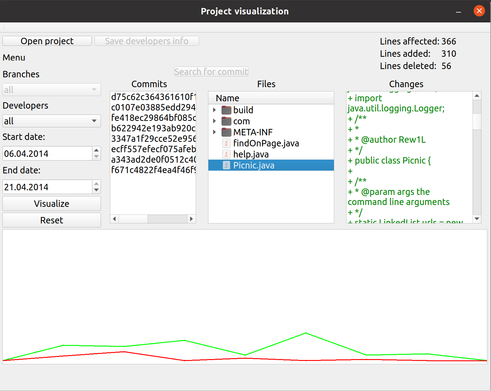

VcsPresenter

Statistics visualizer for version control systems.
git is the only supported vcs by now.

Requirements:
- python >= 3.5
- PySide2
- Qt5
- git

Simply execute this command to run application:
python3 ./main.py

Tested on Ubuntu 20.04:

P.S. This environment variable once made me happy:
DYLD_LIBRARY_PATH=/your/path/to/pyside/libraries
